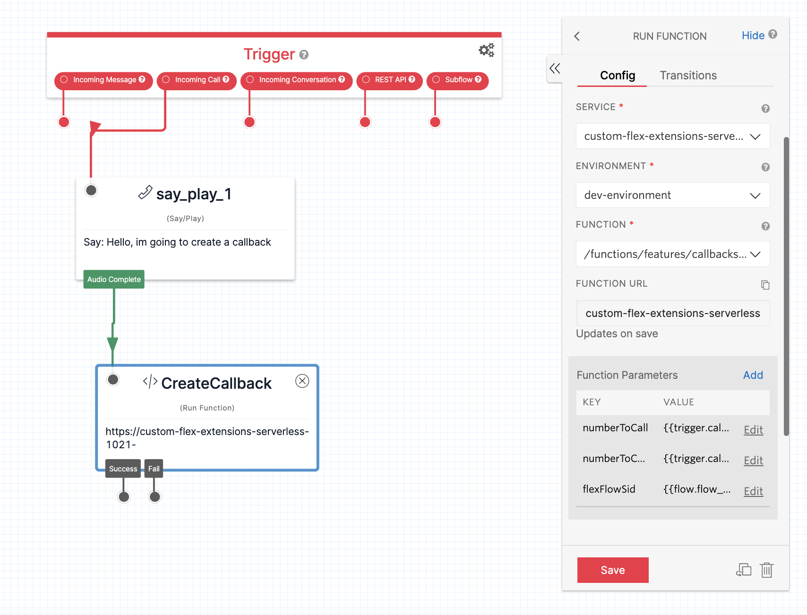

## Details

### Overview

The feature works be registering custom Flex channels for callbacks and voicemails. These channels are a presentation only layer, on top of the taskrouter channel, which remains voice.

When the channel is registered, it renders custom components based on the task attribute; taskType: callback or taskType: voicemail

There are two associated serverless functions called create-callback

The only difference between these functions is one is intended to be called from Flex, the other from anywhere else but typically Studio. The difference is the security model for each function but both do the same thing, taking in task attributes and generating a new callback task. The Flex interface is used for the re-queueing feature.

### Studio Configuration

Creating a callback involves creating a task with at a minimum a number to callback and a number to call from. A sample setup of that is shown here in a studio flow where a number has been wired up to immediately create a callback and hang up.

Here you can see three parameters which are populated from the studio flow

- numberToCall: {{trigger.call.From}} - the number the customer dialed from
- numberToCallFrom: {{trigger.call.To}} - the number the customer tried to dial
- flexFlowSid: {{flow.flow_sid}} - to capture the entry point of this callback, it is stored on the task

This serverless function can be used from anywhere, not just the studio flow, to create a callback task.

The creation of a task requires a workflow. You may create a custom workflow, that uses some collected data to organize the tasks into different queues or maybe something more complex. You may also just want to use the default "Assign To Anyone" workflow that is spawned on a vanilla flex instance.
