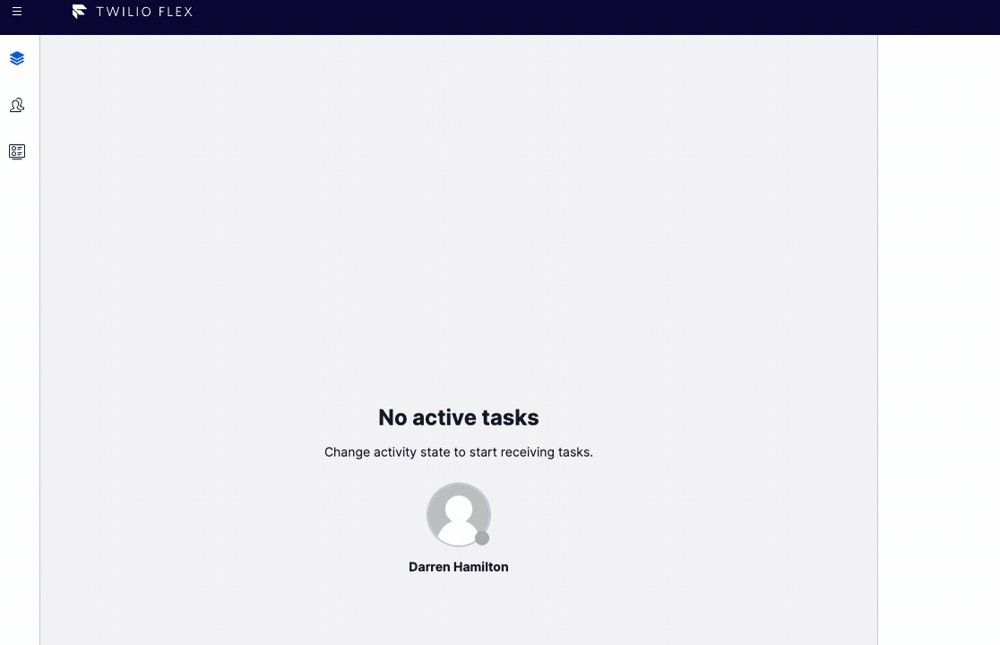
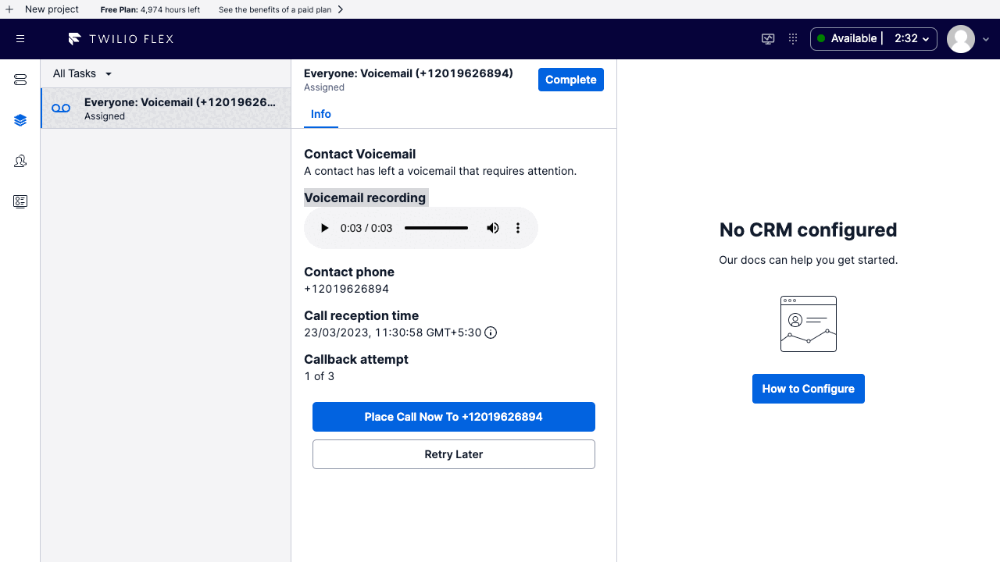
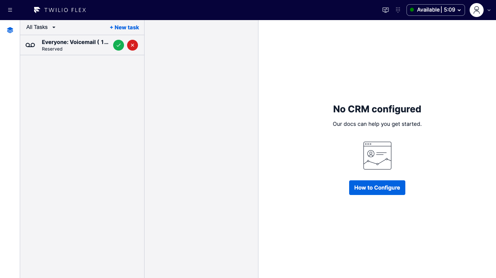
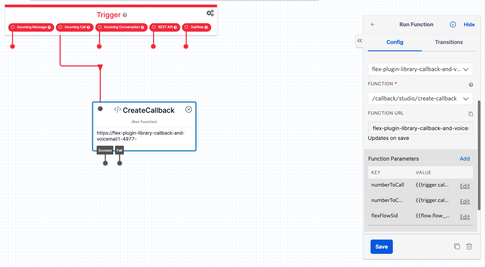
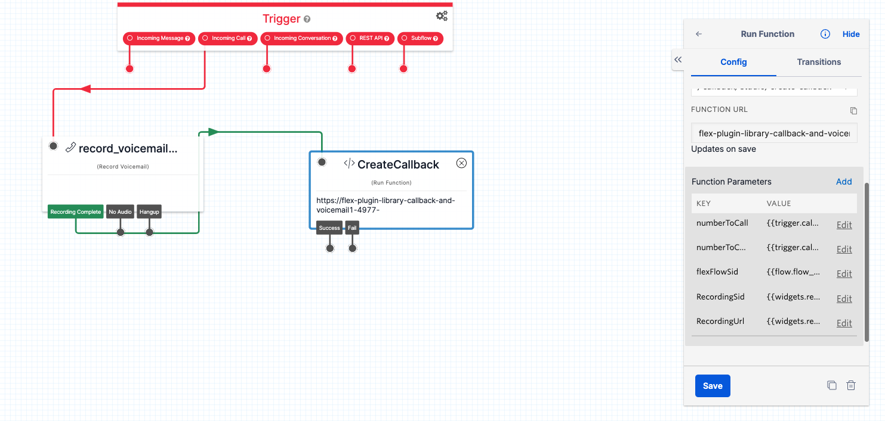
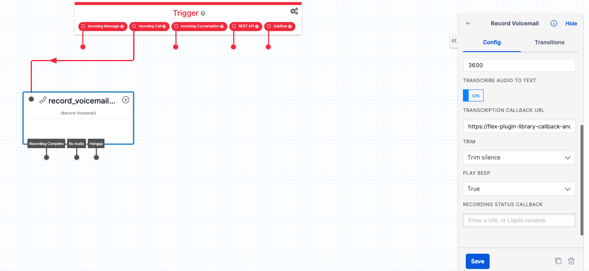

NOTE: This repo is still a WIP (Work In Progress) and the codebase is not yet production ready.

# Flex Callback And Voicemail Plugin

## How it works

The feature works be registering custom flex channels for callbacks and voicemails. These channels are a presentation only layer, on top of the taskrouter channel, which remains voice.

when the channel is registered, it renders custom components based on the task attribute; taskType: callback or taskType: voicemail

there are two associated serverless functions called create-callback

the only difference between these functions is one is intended to be called from flex, the other from anywhere else but typically studio. The difference is the security model for each function but both do the same thing, taking in task attributes and generating a new callback task. The flex interface is used for the re-queueing feature.

## Callbacks and Voicemail

This feature enables the use of callbacks and voicemails as a custom task type. It is a generic version intended to accelerate the customization of such a feature for any particular project, providing the main parts of a callback feature in easy to understand and customizable way.

- the callbacks are placed on the voice channel by default, as its typical projects want callbacks to be threaded in single file with voice calls.
- there is an API for creating the callback so you just have to create your customer experience then decide when to create the callback instead of peeling apart the sample solution.
- [creating a callback](./serverless/src/functions/callback/studio/create-callback.protected.js#L68) has a little more resiliency built in as it uses a retry handler.
- callbacks and voicemails use a shared set of components and functions, as voicemails are effectively callbacks with a voicemail recording attached
- the callback task can be automatically selected after the outbound call back to the contact ends.

# flex-user-experience

The vanilla feature without any further customizations will look like this for callbacks



Voicemails will look like this



Voicemails with transcription will look like this



# Studio Configuration

## Creating a Callback Task Using _create-callback_ Function

Creating a callback involves creating a task with at a minimum a number to callback and a number to call from. A sample setup of that is shown here in a studio flow where a number has been wired up to immediately create a callback and hang up.



here you can see three parameters which are populated from the studio flow

- numberToCall: {{trigger.call.From}} - the number the customer dialed from
- numberToCallFrom: {{trigger.call.To}} - the number the customer tried to dial
- flexFlowSid: {{flow.flow_sid}} - to capture the entry point of this callback, it is stored on the task

This serverless function can be used from anywhere, not just the studio flow, to create a callback task.

The creation of a task requires a workflow. You may create a custom workflow, that uses some collected data to organize the tasks into different queues or maybe something more complex. You may also just want to use the default "Assign To Anyone" workflow that is spawned on a vanilla flex instance.

Once you have decided which workflow you are using, you simply reference it in the environment file for your serverless-functions and make sure it is deployed. The variable that you need to make sure is set is

> TWILIO_FLEX_CALLBACK_WORKFLOW_SID=WW....

## Voicemail Additional Parameters



Creating a voicemail involves the same setup as above, however the following additional parameters must be passed to the create-callback function from a Record Voicemail widget:

- RecordingSid: {{widgets.record_voicemail_1.RecordingSid}} - the recording SID from the Record Voicemail widget
- RecordingUrl: {{widgets.record_voicemail_1.RecordingUrl}} - the recording URL from the Record Voicemail widget

## Using Transcriptions in Voicemail Tasks



If you wish to enable transcriptions and show the transcription text on the voicemail task, you can invoke the create-callback function from the Transcription Callback URL on the Record Voicemail widget. Just be sure to include the required params in the URL. e.g.

`https://flex-plugin-library-callback-and-voicemail1-xxx.twil.io/callback/studio/create-callback?numberToCall={{trigger.call.From | url_encode}}&numberToCallFrom={{trigger.call.To | url_encode}}&flexFlowSid={{flow.sid}}`

NOTE: `RecordingSid` and `RecordingUrl` are already part of the transcription callback event, along with `TranscriptionSid` and `TranscriptionText`. The use of the `url_encode` [Liquid Template Filter](https://www.twilio.com/docs/studio/user-guide/liquid-template-language#standard-filters) allows the leading '+' of the to/from phone numbers to be preserved.

If you do go with the transcription approach, the plugin will take care of rendering the transcription text below the playback controls for the recording - per the screenshot animation above.

# Flex Plugin

This repository is a Flex plugin with some other assets. The following describing how you setup, develop and deploy your Flex plugin.

### Setup

1. Setup all dependencies above: the workflow and Twilio CLI packages.

2. Clone this repository

3. Copy `.env.example` to `.env` and set the following variables:

   - FLEX_APP_SERVERLESS_FUNCTONS_DOMAIN: your Twilio Functions base url (this will be available after you deploy your functions). In local development environment, it could be your localhost base url.

4. run `npm install`

5. copy `./serverless/.env.sample` to `./serverless/.env` and populate the appropriate environment variables.

```
# ACCOUNT SPECIFIC SETTINGS
ACCOUNT_SID=
AUTH_TOKEN=
TWILIO_API_KEY=
TWILIO_API_SECRET=

# GENERAL
TWILIO_FLEX_WORKSPACE_SID=
TWILIO_SERVERLESS_API_CONCURRENCY=10
TWILIO_SERVICE_RETRY_LIMIT=5
TWILIO_SERVICE_MIN_BACKOFF=100
TWILIO_SERVICE_MAX_BACKOFF=300


# CALLBACK(You may also just want to use the default "Assign To Anyone" Task router workflow that is spawned on a vanilla flex instance.)
TWILIO_FLEX_CALLBACK_WORKFLOW_SID=
```

### Development

In order to develop locally, you can use the Twilio CLI to run the plugin locally. Using your commandline run the following from the root dirctory of the plugin.

```bash
twilio flex:plugins:start
```

This will automatically start up the Webpack Dev Server and open the browser for you. Your app will run on `http://localhost:3000`.

When you make changes to your code, the browser window will be automatically refreshed.

### Deploy

#### Plugin Deployment

Once you are happy with your plugin, you have to deploy then release the plugin for it to take affect on Twilio hosted Flex.

Run the following command to start the deployment:

```bash
twilio flex:plugins:deploy --major --changelog "Notes for this version" --description "Functionality of the plugin"
```

After your deployment runs you will receive instructions for releasing your plugin from the bash prompt. You can use this or skip this step and release your plugin from the Flex plugin dashboard here https://flex.twilio.com/admin/plugins

For more details on deploying your plugin, refer to the [deploying your plugin guide](https://www.twilio.com/docs/flex/plugins#deploying-your-plugin).

Note: Common packages like `React`, `ReactDOM`, `Redux` and `ReactRedux` are not bundled with the build because they are treated as external dependencies so the plugin will depend on Flex to provide them globally.

#### Twilio Serverless

You will need the [Twilio CLI](https://www.twilio.com/docs/twilio-cli/quickstart) and the [serverless plugin](https://www.twilio.com/docs/labs/serverless-toolkit/getting-started) to deploy the functions inside the `serverless` folder of this project. You can install the necessary dependencies with the following commands:

`npm install twilio-cli -g`

and then

`twilio plugins:install @twilio-labs/plugin-serverless`

cd into ./serverless/ then run

`npm install`

and then

`twilio serverless:deploy`

(optionally you can run locally with `twilio serverless:start --ngrok=""`)

### Laundry List of activities to be done for each plugin

1. Create individual repo for each plugin
2. Test the plugin against Felx UI 2.x for compatibility
3. Create plugin specific CI/CD files for bundle creation, release creation and test suite
4. UI logs to be replaced with standard ConsoleLogger provided as util in the repo
5. Unit test for UI code (possibly for serverless code)
6. Telemetry (varies from plugin to plugin)
7. Exception handling and serverless retry mechanism (for wherever applicable)
8. E2E test suite for the entire plugin
9. Details.md file to have content that needs to show up on PluginsLibrary frontend
10. Should have License file in the repo
11. Updating the readme.md
